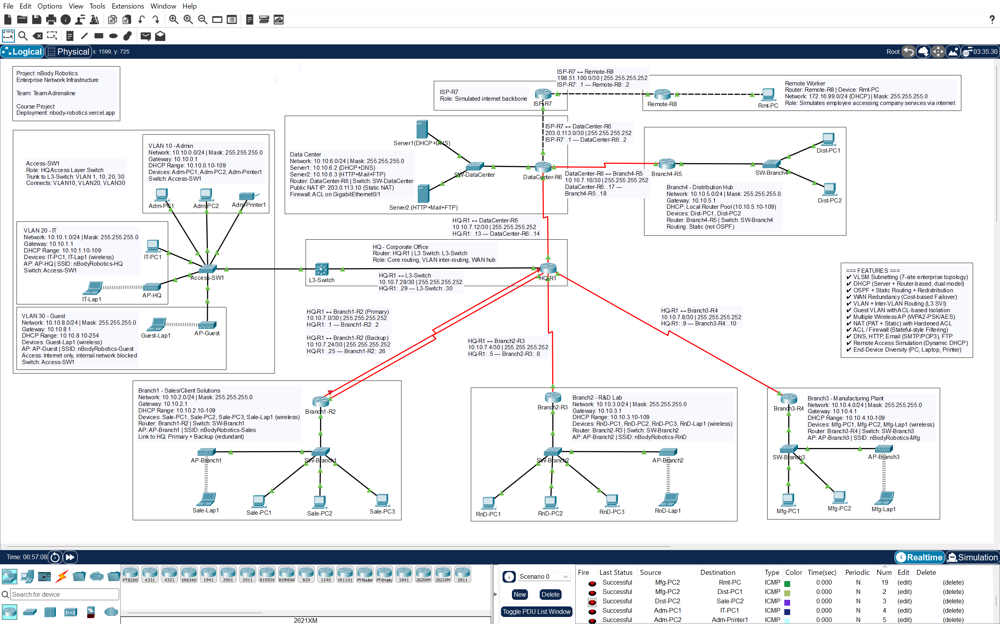

# N-Body Robotics

An enterprise network infrastructure project developed for the **Computer Networks Lab** at **Daffodil International University** using **Cisco Packet Tracer**.

The project simulates a multi-site organizational network with VLAN segmentation, routing, wireless connectivity, network services, security controls, and WAN redundancy.

## 🌐 Project Overview

The **N-Body Robotics Network** is a multi-site enterprise network designed to demonstrate practical computer networking concepts in a simulated environment.

The network includes multiple sites connected through WAN links and implements routing, VLAN segmentation, centralized services, wireless access, security policies, and redundancy mechanisms.

## ✨ Key Features

- 🏢 Multi-site enterprise network architecture
- 🔀 VLAN segmentation and Inter-VLAN routing
- 📐 VLSM-based IPv4 addressing
- 🔄 OSPF and Static Routing
- 🌐 NAT for simulated internet connectivity
- 📡 Wireless network infrastructure
- 📦 DHCP, DNS, HTTP, FTP, and Email services
- 🔐 Access Control Lists (ACLs)
- 🛡️ Guest VLAN isolation
- 🔁 WAN redundancy and failover
- 🧪 Network connectivity and service verification
- 📊 Detailed network documentation

## 🏗️ Network Architecture

The simulated infrastructure consists of:

- **7 Sites**
- **8 Routers**
- **7 Switches**
- **5 Wireless Access Points**
- Multiple VLANs and network segments
- WAN connectivity between sites

### Network Topology



## 🛠️ Technologies & Concepts

| Category | Technologies / Concepts |
|---|---|
| Simulation | Cisco Packet Tracer |
| Routing | OSPF, Static Routing |
| Switching | VLAN, Inter-VLAN Routing |
| IP Addressing | IPv4, VLSM |
| Network Services | DHCP, DNS, HTTP, FTP, Email |
| Security | ACL, Guest VLAN Isolation |
| Connectivity | NAT, WAN, Wireless Networking |
| Reliability | WAN Redundancy & Failover |

## 🧪 Testing & Verification

The project includes practical verification of:

- Inter-site connectivity
- Inter-VLAN communication
- DHCP address assignment
- DNS resolution
- Web server accessibility
- FTP connectivity
- Email communication
- NAT functionality
- ACL enforcement
- Guest network isolation
- WAN failover and redundancy

The project documentation also records the troubleshooting process and the diagnostic tools used during implementation, including routing, NAT, ACL, MAC-table, ARP, and IP-configuration checks.

## 📁 Project Structure

```text
nbody-robotics/
├── assets/
│   ├── favicon.png
│   └── pt_topology_screenshot.png
├── index.html
└── README.md
```

## 📚 Project Documentation

A detailed HTML documentation page is included in `index.html`, covering:

- Network architecture
- VLSM addressing
- Device inventory
- Port-to-port cabling
- Router configurations
- VLAN and wireless configuration
- Routing design
- Network services
- NAT and security
- ACL reference
- Testing methodology
- Troubleshooting
- Final verification

## 👥 Team

Developed collaboratively by **Team Adrenaline** for the Computer Networks Lab at Daffodil International University.

## 🎓 Academic Context

- **Course:** Computer Networks Lab
- **Institution:** Daffodil International University
- **Project Type:** Academic Networking Project
- **Team:** Team Adrenaline

## 🌐 Live Documentation

**Project Documentation:** https://nbody-robotics.vercel.app/

## 📌 Project Status

Completed academic networking project maintained as part of my technical project portfolio.
